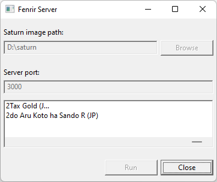

# Webserver for fenrir

## How to compile?
This project need [CMake](https://cmake.org/).

If you're on a Linux(or wsl) system, it can be compiled like this:

```
mkdir build
cd build
cmake ..
make
```

## Usage

The server will traverse the file tree of the specified folder and look for files with ".iso", ".cue", ".chdr", ".gdi", ".nrg" extension

```
FenrirServer -d <folder>
```

For example:

```bash
./FenrirServer -d /chd/ --verbose
```

## Options

* `-d, --dir` set the
CD Image directory to serve
* `-p, --port` set the http port used
* `--link` use mdns to discover fenrir over the network and link it with the server
* `--verbose` display more debug in command line

## Gui 

An optionnal wx-widgets gui build is possible, see CMakeLists.txt for detail.




## Compatible image formats

It supports .cue/.nrg/.iso/.chd.

Compatible image format is provided by mame and libchr libraries.


## Licence
[Mongoose](https://cesanta.com/) as http server.

Toc parsing based on [MAME](https://docs.mamedev.org/).

[libchdr](https://github.com/rtissera/libchdr) for CHD supports.

are each distrubted under their own terms.

[mdns](https://github.com/mjansson/mdns) for mdns discovery.


## Docker

You can use Docker to launch the server.

For example:

```ps
docker run --rm -it --init  -p 3000:3000 -v ${pwd}:/isos ghcr.io/fenrir-ode/webserver:main FenrirServer -d /isos/
```


## API


* /toc 

Parse the .cue and return an array of raw_toc_dto_t

``` c
typedef struct
{
    uint8_t ctrladr;
    uint8_t tno;
    uint8_t point;
    uint8_t min;
    uint8_t sec;
    uint8_t frame;
    uint8_t zero;
    uint8_t pmin;
    uint8_t psec;
    uint8_t pframe;
} raw_toc_dto_t;
```

* /data

Send the binaries data, use [Http Header Range](https://developer.mozilla.org/en-US/docs/Web/HTTP/Headers/Range) to return the correct chunks


